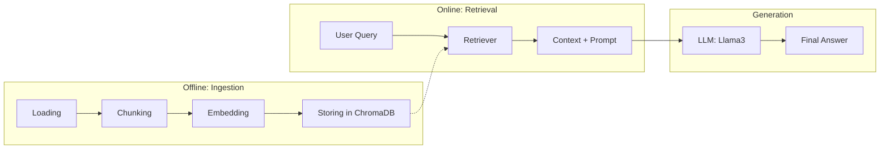

# Module 01: Naive RAG 🧩

The **01_Naive_RAG** module is the entry point of the **RAGgedy** educational series. It demonstrates a complete, local-first RAG pipeline using LlamaIndex and Ollama. 

---

## 🏗️ Architecture Breakdown

This module implements a standard "Naive" RAG flow:



---

## 🛠️ Components & Configuration

All configurations are centralized in `config.py`.

| Parameter | Default (Good) | Broken (Variant) |
|---|---|---|
| **CHUNK_SIZE** | 512 | 4096 |
| **CHUNK_OVERLAP** | 64 | 0 |
| **TOP_K** | 5 | 1 |

---

## 🚀 How to Use

### 1. Ingestion
Build your vector index by processing the active dataset (default: *Edu-Scholar* under `data/datasets/edu_scholar/`).

To use another scenario, add `data/datasets/<your_id>/passages/` (and optional `questions.json`), then set `RAGGEDY_DATASET` before running scripts (see `data/README.md`).

```bash
python ingest.py
```

### 2. Querying
Ask questions through the interactive CLI.
```bash
python query.py
```

### 3. Evaluation
Run [Ragas](https://docs.ragas.io/en/stable/) to see why our "Good" pipeline is better than the "Broken" one.
```bash
# Evaluate Default (Good) Pipeline
python evaluation/eval_naive.py
```

---

## 🧪 The "Broken" Variant

This module includes an intentionally degraded script: `ingest_broken.py`. 
Run this to see how poor architectural decisions (like massive chunks without overlap) degrade Faithfulness and Context Precision scores.

---

## 📘 Walkthrough Notebook

For a step-by-step guided tutorial with visualizations of each stage, open `notebooks/01_walkthrough.ipynb`.
