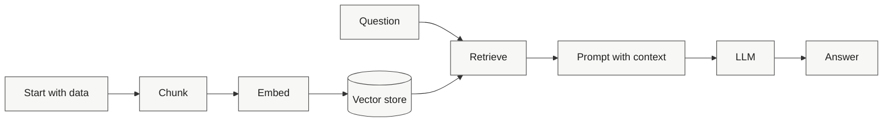

# Module 01: Naive RAG 🧩

This module is the baseline RAG path for RAGgedy. It shows the full local-first flow with the fewest moving parts so you can see the pipeline clearly before adding more retrieval logic.

---

## 🗺️ Visual Learning Path



The idea is to inspect one stage at a time, then compare how the output changes when you alter chunking or retrieval settings.

---

## 📚 Key Files

| File | What it controls |
|---|---|
| [config.py](config.py) | Chunk size, overlap, and top-k defaults |
| [ingest.py](ingest.py) | The normal ingestion pipeline |
| [ingest_broken.py](ingest_broken.py) | Intentionally degraded ingestion variant |
| [query.py](query.py) | Interactive question answering |
| [ANSWER_KEY.md](ANSWER_KEY.md) | Correct sequence, commands, and expected visualization |
| [evaluation/eval_naive.py](evaluation/eval_naive.py) | Baseline evaluation script |
| [notebooks/01_walkthrough.ipynb](notebooks/01_walkthrough.ipynb) | Visual, step-by-step walkthrough |
| [data/README.md](data/README.md) | Dataset layout and `RAGGEDY_DATASET` usage |

---

## 🚀 Run It

1. Build the index.

```bash
python ingest.py
```

2. Ask questions.

```bash
python query.py
```

Native popup visualization is on by default (no localhost). You can also run one-shot mode:

```bash
python query.py --question "Why does chunking help?"
```

Visualization flags for query:

- `--visualize auto` popup with terminal fallback (default)
- `--visualize terminal` print only
- `--visualize off` no rendering output

2.5. Open visualization directly from this module (no separate setup page).

```bash
python visualize.py --dataset edu_scholar
```

Auto-run ingestion when the UI opens:

```bash
python visualize.py --dataset edu_scholar --auto-ingest
```

3. Evaluate the baseline.

```bash
python evaluation/eval_naive.py
```

If you want to use a different dataset, create `data/datasets/<your_id>/passages/` and optionally `questions.json`, then set `RAGGEDY_DATASET` before running the scripts.

---

## 🧪 Compare the Broken Variant

`ingest_broken.py` is intentionally bad on purpose. Use it to see how large chunks and missing overlap change the retrieval trace and weaken Faithfulness and Context Precision.

---

## 📘 Visual Walkthrough

Open [notebooks/01_walkthrough.ipynb](notebooks/01_walkthrough.ipynb) to follow the pipeline stage by stage with visuals and outputs.
