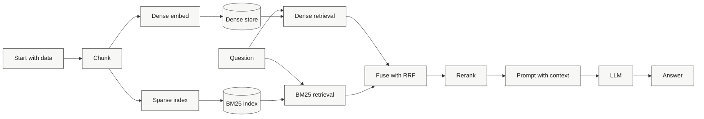

# Module 02: Advanced RAG 🧩

This module extends the baseline pipeline with hybrid retrieval and reranking. The goal is still to keep the learning path visual and inspectable, but now you can see how dense and sparse retrieval combine before the answer is generated.

---

## 🗺️ Visual Learning Path



The visual story here is: retrieve from two angles, fuse the evidence, then rerank before generation.

---

## 📚 Key Files

| File | What it controls |
|---|---|
| [config.py](config.py) | Chunking, BM25, fusion, and reranker defaults |
| [ingest.py](ingest.py) | Hybrid ingestion pipeline |
| [ingest_broken.py](ingest_broken.py) | Intentionally degraded hybrid variant |
| [query.py](query.py) | Hybrid retrieval and generation flow |
| [ANSWER_KEY.md](ANSWER_KEY.md) | Correct sequence, commands, and expected visualization |
| [evaluation/eval_advanced.py](evaluation/eval_advanced.py) | Advanced evaluation script |
| [notebooks/02_walkthrough.ipynb](notebooks/02_walkthrough.ipynb) | Visual walkthrough of hybrid retrieval |
| [data/README.md](data/README.md) | Dataset layout and `RAGGEDY_DATASET` usage |

---

## 🚀 Run It

1. Build the indexes.

```bash
python ingest.py
```

2. Ask questions through the hybrid retriever.

```bash
python query.py
```

Native popup visualization is on by default (no localhost). You can also run one-shot mode:

```bash
python query.py --question "How does reranking improve quality?"
```

Visualization flags for query:

- `--visualize auto` popup with terminal fallback (default)
- `--visualize terminal` print only
- `--visualize off` no rendering output

2.5. Open visualization directly from this module (no separate setup page).

```bash
python visualize.py --dataset edu_scholar
```

Auto-run ingestion when the UI opens:

```bash
python visualize.py --dataset edu_scholar --auto-ingest
```

3. Evaluate the pipeline.

```bash
python evaluation/eval_advanced.py
```

If you want to use a different dataset, create `data/datasets/<your_id>/passages/` and optionally `questions.json`, then set `RAGGEDY_DATASET` before running the scripts.

---

## 🧪 Compare the Broken Variant

`ingest_broken.py` removes the hybrid behavior on purpose. Use it to see how much recall and ranking quality drop when BM25 fusion or reranking is missing.

---

## 📘 Visual Walkthrough

Open [notebooks/02_walkthrough.ipynb](notebooks/02_walkthrough.ipynb) to inspect the retrieval stages, score combination, and reranking flow visually.
