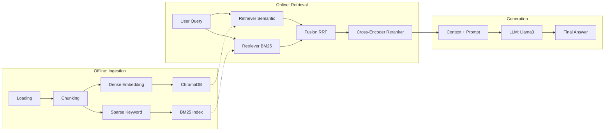

# Module 02: Advanced RAG 🧩

The **02_Advanced_RAG** module introduces the hybrid search and reranking architecture. It builds upon the naive approach from Module 01 by resolving issues with semantic ambiguity, significantly boosting contextual relevance and accuracy.

---

## 🏗️ Architecture Breakdown

This module implements a powerful "Hybrid" RAG flow using Reciprocal Rank Fusion and Cross-Encoders:



---

## 🛠️ Components & Configuration

All configurations are centralized in `config.py`.

| Parameter | Default (Good) | Broken (Variant) |
|---|---|---|
| **BM25 / Sparse** | Enabled | **Disabled** |
| **Fusion (RRF)** | Enabled | **Disabled** |
| **Cross-Encoder** | `ms-marco-MiniLM...` | **Off / Weaker Dense Model** |
| **CHUNK_SIZE** | 512 | 1024 |
| **CHUNK_OVERLAP** | 64 | 0 |

---

## 🚀 How to Use

### 1. Ingestion
Build your dual-vector and sparse indices by processing the active dataset (default: *Edu-Scholar* under `data/datasets/edu_scholar/`).

To use another scenario, add `data/datasets/<your_id>/` with `passages/` (and optional `questions.json`), then set **`RAGGEDY_DATASET`** before running scripts (see `data/README.md`).

```bash
python ingest.py
```

### 2. Querying
Ask questions through the interactive CLI to test hybrid results.
```bash
python query.py
```

### 3. Evaluation
Run [Ragas](https://docs.ragas.io/en/stable/) to observe the measurable gap caused by missing out on hybrid architecture principles via our mock RAGAS comparison tools.
```bash
# Evaluate Default (Good) Pipeline
python evaluation/eval_advanced.py
```

---

## 🧪 The "Broken" Variant

This module includes an intentionally degraded script: `ingest_broken.py`. 
Run this to observe how excluding BM25 fusion and advanced Cross-Encoder context reranking allows irrelevant context into the prompt, reducing Faithfulness and Context Precision.

---

## 📘 Walkthrough Notebook

For a step-by-step guided tutorial with visualizations of hybrid score distributions, open `notebooks/02_walkthrough.ipynb`.
