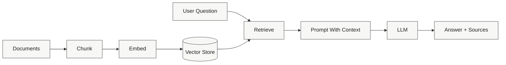

# RAGgedy 🧩

<div align="center">

### Open-Source RAG Templates That Start Simple and Scale Clearly


</div>

RAGgedy is a learning-first RAG repo built like Lego blocks: each module isolates one architectural idea so you can see what changed, why it changed, and how quality improves.

---

## 🧭 Start Here

If you want the shortest path into the repo, use one of these lanes:

- Learn the repo: [docs/zero_barrier/TUTORIAL_ELI5.md](docs/zero_barrier/TUTORIAL_ELI5.md), [docs/zero_barrier/CODE_STRUCTURE_PLAN.md](docs/zero_barrier/CODE_STRUCTURE_PLAN.md), and [visualization/README.md](visualization/README.md)
- Explore the modules: [01_Naive_RAG/README.md](01_Naive_RAG/README.md) and [02_Advanced_RAG/README.md](02_Advanced_RAG/README.md)
- Try the runtime: [zero_barrier_runtime/app.py](zero_barrier_runtime/app.py) and [zero_barrier_runtime/scripts/mock_trace_demo.py](zero_barrier_runtime/scripts/mock_trace_demo.py)

---

## 🏗️ Architecture At A Glance



---

## 📚 Module Map

| Module | What you learn | Main docs | Run / eval |
|---|---|---|---|
| 01_Naive_RAG | Baseline chunk -> embed -> retrieve -> generate | [README](01_Naive_RAG/README.md), [notebook](01_Naive_RAG/notebooks/01_walkthrough.ipynb) | [ingest](01_Naive_RAG/ingest.py), [query](01_Naive_RAG/query.py), [eval](01_Naive_RAG/evaluation/eval_naive.py) |
| 02_Advanced_RAG | Hybrid retrieval (dense + BM25), RRF, rerank | [README](02_Advanced_RAG/README.md), [notebook](02_Advanced_RAG/notebooks/02_walkthrough.ipynb) | [ingest](02_Advanced_RAG/ingest.py), [query](02_Advanced_RAG/query.py), [eval](02_Advanced_RAG/evaluation/eval_advanced.py) |
| Visualization | Live ingest/query stepping | [README](visualization/README.md) | [app](visualization/app.py) |

---

## 🚀 Quick Start

### 1) Set up the environment once

```bash
python -m venv .venv
.venv\Scripts\activate
pip install -r 01_Naive_RAG/requirements.txt
pip install -r 02_Advanced_RAG/requirements.txt
pip install -r visualization/requirements.txt
```

### 2) Pick one path

Pick the group that matches what you want to do.

<details>
<summary>Mock and trace</summary>

```bash
python -m zero_barrier_runtime.app --mode mock --question "Why does chunking help?" --show-trace
python -m zero_barrier_runtime.scripts.mock_trace_demo
```

</details>

<details>
<summary>Module pipelines</summary>

```bash
cd 01_Naive_RAG
python ingest.py
python query.py

cd 02_Advanced_RAG
python ingest.py
python query.py
```

</details>

<details>
<summary>Live UI and API/local modes</summary>

```bash
python 01_Naive_RAG/visualize.py --dataset edu_scholar
python 02_Advanced_RAG/visualize.py --dataset edu_scholar

set MODEL_PROVIDER=groq
set MODEL_NAME=llama-3.1-8b-instant
set MODEL_API_KEY=your_api_key_here
python -m zero_barrier_runtime.app --mode api --question "Explain vector embeddings like I am 5"

ollama pull llama3.1:8b
python -m zero_barrier_runtime.app --mode local --local-model llama3.1:8b --question "How does retrieval improve answer quality?"
```

Optional auto-ingest at startup:

```bash
python 01_Naive_RAG/visualize.py --dataset edu_scholar --auto-ingest
```

</details>

### 3) Follow the deeper paths when you are ready

- [01_Naive_RAG/README.md](01_Naive_RAG/README.md)
- [02_Advanced_RAG/README.md](02_Advanced_RAG/README.md)
- [visualization/README.md](visualization/README.md)
- [docs/zero_barrier/TUTORIAL_ELI5.md](docs/zero_barrier/TUTORIAL_ELI5.md)

---

## 🧪 Evaluation Targets

| Module | Faithfulness | Context Precision | Eval script |
|---|---:|---:|---|
| 01_Naive_RAG | 0.55+ | 0.60+ | [eval_naive.py](01_Naive_RAG/evaluation/eval_naive.py) |
| 02_Advanced_RAG | 0.65+ | 0.72+ | [eval_advanced.py](02_Advanced_RAG/evaluation/eval_advanced.py) |

---

## 🧠 Why This Repo Feels Different

- Learning-first: every module is runnable and intentionally scoped.
- Compare-forward: good vs broken variants show failure modes clearly.
- Zero-barrier: mock, cloud, and local paths support different hardware realities.

---

## ⚖️ License

[LICENSE](LICENSE) (MIT)
