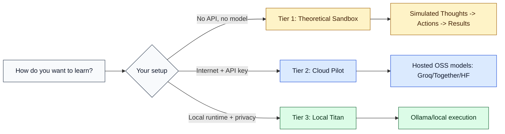
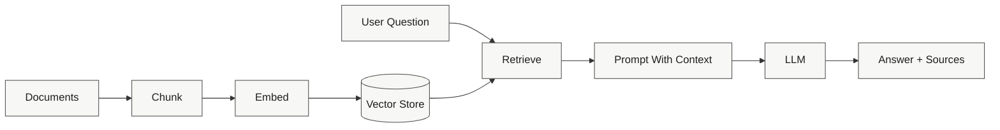
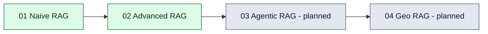

# RAGgedy 🧩

<div align="center">

### Open-Source RAG Templates That Start Simple and Scale Clearly


</div>

RAGgedy is a learning-first RAG repo built like Lego blocks: each module isolates one architectural idea so you can see what changed, why it changed, and how quality improves.

---

## 🗺️ Pick Your Path (Zero-Barrier)



### Start in under 2 minutes

```bash
python -m zero_barrier_runtime.app --mode mock --question "Why does chunking help?" --show-trace
python -m zero_barrier_runtime.scripts.mock_trace_demo
```

Design docs for the zero-barrier model:

- [docs/zero_barrier/README_TEMPLATE.md](docs/zero_barrier/README_TEMPLATE.md)
- [docs/zero_barrier/CODE_STRUCTURE_PLAN.md](docs/zero_barrier/CODE_STRUCTURE_PLAN.md)
- [docs/zero_barrier/TUTORIAL_ELI5.md](docs/zero_barrier/TUTORIAL_ELI5.md)

---

## 🏗️ Architecture At A Glance



---

## 📚 Module Map

| Module | What you learn | Run docs |
|---|---|---|
| 01_Naive_RAG | Baseline chunk -> embed -> retrieve -> generate | [01_Naive_RAG/README.md](01_Naive_RAG/README.md) |
| 02_Advanced_RAG | Hybrid retrieval (dense + BM25), RRF, rerank | [02_Advanced_RAG/README.md](02_Advanced_RAG/README.md) |



---

## 🚀 Quick Start

### 1) Setup

```bash
git clone https://github.com/Troy-LL/RAGgedy.git
cd RAGgedy
python -m venv .venv
```

Windows:

```bash
.venv\Scripts\activate
```

Linux/macOS:

```bash
source .venv/bin/activate
```

### 2) Install dependencies

```bash
pip install -r 01_Naive_RAG/requirements.txt
pip install -r 02_Advanced_RAG/requirements.txt
```

### 3) Run baseline module

```bash
cd 01_Naive_RAG
python ingest.py
python query.py
```

### 4) Run advanced module

```bash
cd 02_Advanced_RAG
python ingest.py
python query.py
```

### 5) Optional visualization app

```bash
pip install -r visualization/requirements.txt
streamlit run visualization/app.py
```

See [visualization/README.md](visualization/README.md) for stage-by-stage UI behavior.

---

## 🧪 Evaluation Targets

| Module | Faithfulness | Context Precision |
|---|---:|---:|
| 01_Naive_RAG | 0.55+ | 0.60+ |
| 02_Advanced_RAG | 0.65+ | 0.72+ |

Run:

```bash
python 01_Naive_RAG/evaluation/eval_naive.py
python 02_Advanced_RAG/evaluation/eval_advanced.py
```

---

## 🧠 Why This Repo Feels Different

- Learning-first: every module is runnable and intentionally scoped.
- Compare-forward: good vs broken variants show failure modes clearly.
- Zero-barrier: mock, cloud, and local paths support different hardware realities.

---

## ⚖️ License

[LICENSE](LICENSE) (MIT)
