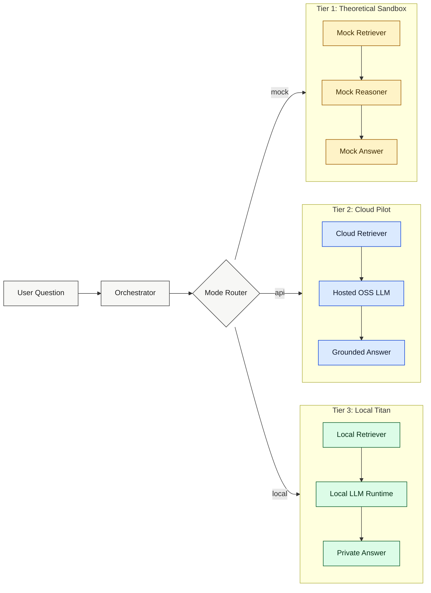

# Zero-Barrier README Template

> Copy this file into your project root as `README.md` when you want a polished, learner-first experience.

<div align="center">

# RAGgedy Zero-Barrier Edition

### Learn fast. Run anywhere. Scale when ready.


</div>

---

## What Is This? 🧠

This repo teaches Retrieval-Augmented Generation (RAG) in three hardware-friendly tiers:

- Tier 1: Theoretical Sandbox (Mock Mode) for instant learning with zero APIs and zero model downloads.
- Tier 2: Cloud Pilot (API Mode) for open-source models through hosted APIs.
- Tier 3: Local Titan (On-Prem Mode) for private local model execution.

If you can run Python, you can start.

---

## Choose Your Adventure 🗺️

| Tier | Best For | Needs | Speed to First Win |
|---|---|---|---|
| 1. Theoretical Sandbox | First-time learners | Python only | ~2 minutes |
| 2. Cloud Pilot | Real model outputs, no heavy setup | API key + internet | ~5 minutes |
| 3. Local Titan | Privacy + full control | Local inference stack | ~20-60 minutes |

---

## Architecture At A Glance 🏗️



---

## Quick Start 🚀

### Tier 1: Theoretical Sandbox (Mock Mode)

```bash
python -m venv .venv
.venv\Scripts\activate  # Windows
pip install -r requirements.txt
python -m zero_barrier_runtime.app --mode mock --question "Why do we chunk documents?"
```

Why this matters:
- You learn the full RAG loop instantly without cost or setup friction.

How to play:
- Change the question.
- Change the fake retrieval snippets.
- Observe how reasoning and final answer change.

### Tier 2: Cloud Pilot (API Mode)

```bash
set MODEL_PROVIDER=groq
set MODEL_NAME=llama-3.1-8b-instant
set MODEL_API_KEY=your_key_here
python -m zero_barrier_runtime.app --mode api --question "Explain vector embeddings simply"
```

Why this matters:
- You get real open-source model behavior while keeping setup light.

How to play:
- Switch providers: groq, together, huggingface.
- Compare latency and answer quality.
- Log token usage and estimate cost.

### Tier 3: Local Titan (On-Prem)

```bash
# Example with Ollama runtime
ollama pull llama3.1:8b
python -m zero_barrier_runtime.app --mode local --local-model llama3.1:8b --question "How does retrieval improve truthfulness?"
```

Why this matters:
- You get privacy, reproducibility, and offline operation.

How to play:
- Swap local models.
- Tune chunk size and top-k retrieval.
- Run side-by-side evaluations against API mode.

---

## The ELI5 Corner 🧸

- Embeddings are like turning every sentence into a map pin so similar ideas sit near each other.
- Retrieval is like asking a librarian for the right shelf before writing your book report.
- Reranking is like sorting your top book picks from "pretty good" to "exactly what you needed".

See tutorial module: `docs/zero_barrier/TUTORIAL_ELI5.md`

---

## Project Layout 📁

```text
project-root/
  app.py
  requirements.txt
  src/
    core/
      interfaces.py
      orchestrator.py
      types.py
    modes/
      mock_mode.py
      api_mode.py
      local_mode.py
    retrieval/
      vector_store.py
      bm25_store.py
      hybrid.py
    llm/
      cloud_clients.py
      local_clients.py
    tutorials/
      playground_prompts.py
  docs/
    zero_barrier/
      README_TEMPLATE.md
      CODE_STRUCTURE_PLAN.md
      TUTORIAL_ELI5.md
```

---

## Learning Roadmap 🧭

- Step 1: Run mock mode and inspect the action trace.
- Step 2: Run API mode with hosted open models.
- Step 3: Run local mode and compare outputs.
- Step 4: Tune retrieval and evaluate quality.

---

## Contributing 🤝

PRs are welcome. New examples should include:
- Why it matters
- How to play
- One Mermaid diagram
- One runnable command

---

## License 📜

MIT
